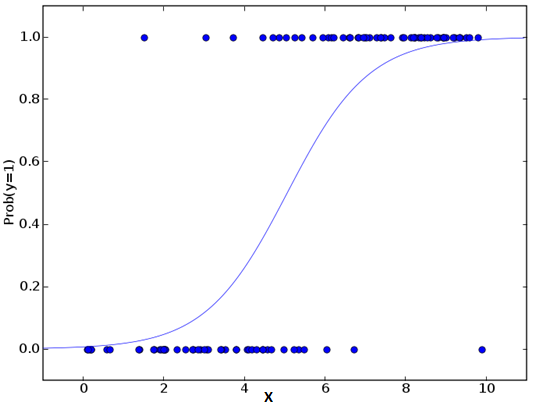
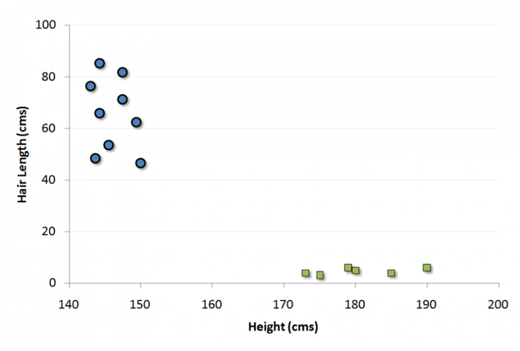
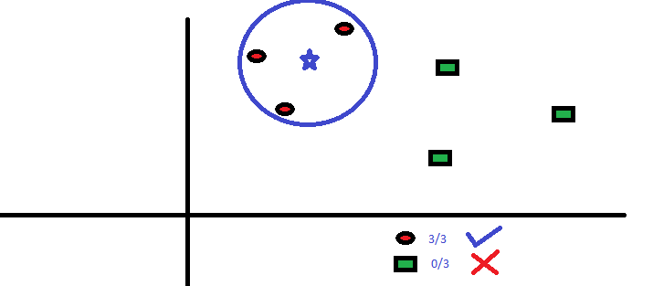
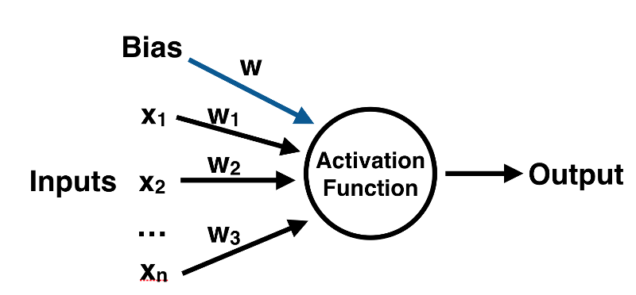
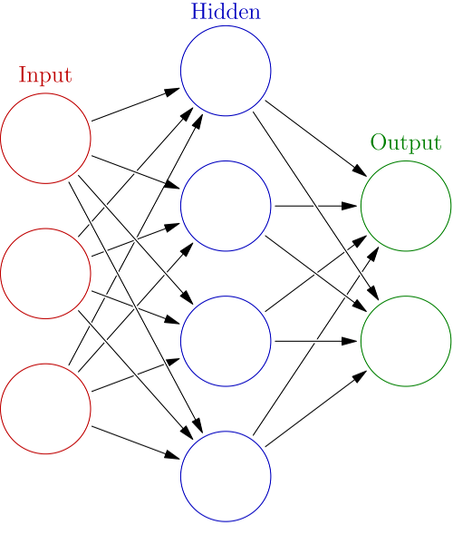
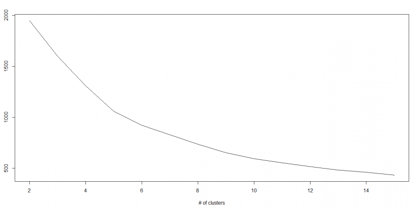

# autoML 
##### Information technology study about machine learning using the libray scikit-learn for the Python programming language and their related concepts. 

First, we need to know that machine learning is the field of study that gives computers the ability to learn without being explicitly programmed, this is a denifition 
described by Arthur Samuel, an American pioneer in the field of computer gaming and artificial intelligence and the coined the term **"Machine Learning"** in 1959 while at 
IBM. Tom Mitchell provides a more modern definition: "A computer program is said to learn from **experience E** with respect to some class of **tasks T** and **performance measure P**,
if its performance at tasks in T, as measured by P, improves with experience E. So, int machine learning there are two types of algorithms to solve problems of data 
analytics: the **supervised Learning** and the **unsupervised learning**. Finally, in learning data science with Python, generally, we use the **scikit-learn**, a open source Python
library that implements a wide variety of machine learning,  preprocessing, cross-validation and visualization algorithms with the help of a unified interface. Depending
on the input data, we will use different methods implemented in the the library, as shown in the image below:
<p align="center">  </p>

## Supervised Learning 

In supervised learning, we are given a data set and already know what our correct output should look like, having the idea that there is a relationship between the input and the output.
Supervised learning problems are categorized into "regression" and "classification" problems. In a regression problem, we are trying to predict results within a **continuous output**, 
meaning that we are trying to map input variables to some continuous function. In a classification problem, we are instead trying to predict results in a discrete output. In other words,
we are trying to map input variables into discrete categories. Examples of supervised learning are: Regression, Decision Tree, Random Forest, KNN, Logistic Regression, etc.

###### Linear Regression

Linear regression attempts to model the relationship between two variables by **fitting** a linear equation to **observed** data. One variable is considered to be an 
explanatory variable, and the other is considered to be a dependent variable.  Before attempting to fit a linear model to observed data, a modeler should first
determine whether or not there is a relationship between the variables of interest. This does not necessarily imply that one variable causes the other, but that
there is some significant association between the two variables. 
A linear regression line has an equation of the form **Y = a + bX**, where X is the **explanatory** variable and Y is the **dependent** variable. The slope of the line is
b, and a is the intercept (the value of y when x = 0). See the example below. Here we have identified the best fit line having the linear equation y = 0.2811x + 13.9.
Now, using this equation, we can find the weight, knowing the height of a person.
<p align="center">  </p>
Finally, linear regressions can be two types: Simple Linear Regression and Multiple Linear Regression. Simple Linear Regression is characterized by an 
independent variable and multiple linear regression is characterized by multiple independent variables and by looking for the best fit line. So below there is a python code with an example using linear regression:

```python
#Import Library
#Import other necessary libraries like pandas, numpy...
from sklearn import linear_model
#Load Train and Test datasets
#Identify feature and response variable(s) and values must be numeric and numpy arrays
x_train=input_variables_values_training_datasets
y_train=target_variables_values_training_datasets
x_test=input_variables_values_test_datasets
# Create linear regression object
linear = linear_model.LinearRegression()
# Train the model using the training sets and check score
linear.fit(x_train, y_train)
linear.score(x_train, y_train)
#Equation coefficient and Intercept
print('Coefficient: \n', linear.coef_)
print('Intercept: \n', linear.intercept_)
#Predict Output
predicted= linear.predict(x_test)
```
For more detail on this, please refer  this [link](http://scikit-learn.org/stable/modules/linear_model.html).

###### Logistic Regression

It is used to estimate **discrete values** (binary values as 0/1, yes / no, true / false) based on a group of independent variables. In simple words, it predicts the 
probability of an event occurring, adjusting the data to a logistic function. Therefore, it is also known as logistic regression. As predicted by the probability, 
its output values are something expected between 0 and 1. It is useful for modeling the probability of an **event occurring as a function of other factors**. 
So, the chances of the result are modeled as a linear combination of the forecast variables.

**(p / (1-p)) logit (p) = ln (p / (1-p)) probability of occurrence / probability of occurrence ln (odds) = ln = b0 + b1X1 + b2X2 + b3X3 .... + bkXk**

Above, p is the probability of the presence of the characteristic of interest. It chooses the parameters that **maximize the probability** of observing sample values
rather than **minimizing the sum of error square** (as in simple regression). Now, using this equation, we can plot the results in graphic below:
<p align="center">  </p>
So below there is a python code with an example using logistic regression:

```python
#Import Library
from sklearn.linear_model import LogisticRegression
#Assumed you have, X (predictor) and Y (target) for training data set and x_test(predictor) of test_dataset
# Create logistic regression object
model = LogisticRegression()
# Train the model using the training sets and check score
model.fit(X, y)
model.score(X, y)
#Equation coefficient and Intercept
print('Coefficient: \n', model.coef_)
print('Intercept: \n', model.intercept_)
#Predict Output
predicted= model.predict(x_test)
```
For more detail on this, please refer  this [link](http://scikit-learn.org/stable/modules/linear_model.html#logistic-regression).

###### Decision Tree

It is a type of supervised learning algorithm most commonly used for classification problems. Surprisingly, it works for both categorical and continuous dependent
variables. In these algorithms we divide the population into two or more homogeneous groups. This is done based on the most significant independent attributes or 
variables to make the groups as distinct as possible.
<p align="center">  </p>
In the image above, it can be seen that the population is classified into two different groups based on multiple attributes, to identify if they will PLAY or not.
To divide the population into different and heterogeneous groups, several techniques are used, such as Gini, Information Gain, Chi-Square and entropy.
So below there is a python code with an example using decision tree:
```python
#Import Library
#Import other necessary libraries like pandas, numpy...
from sklearn import tree
#Assumed you have, X (predictor) and Y (target) for training data set and x_test(predictor) of test_dataset
# Create tree object 
model = tree.DecisionTreeClassifier(criterion='gini') # for classification, here you can change the algorithm as gini or entropy (information gain) by default it is gini  
# model = tree.DecisionTreeRegressor() for regression
# Train the model using the training sets and check score
model.fit(X, y)
model.score(X, y)
#Predict Output
predicted= model.predict(x_test)
```
For more detail on this, please refer  this [link](http://scikit-learn.org/stable/modules/tree.html).
###### SVM

It is a method of classification. In this algorithm, each data is plotted as a point in an n-dimensional space (where n is the number of characteristics that one has)
with the value of each characteristic being the value of a particular coordinate, these coordinates are called Support Vectors.
<p align="center">  </p>
Now let's find a line that divides the data into two different groups of classified data. The line will be at the nearest point where the distances of each point in the
two groups will be as large as possible.
<p align="center">  </p>
In the example above, the line dividing the data into two sorted groups is the black line, because the two closest points are the farthest, off the line. This is our classifier.
So, depending on which side of the line test data is placed, this will be the class in which the new data can be sorted.
So below there is a python code with an example using decision svm:
```python
#Import Library
from sklearn import svm
#Assumed you have, X (predictor) and Y (target) for training data set and x_test(predictor) of test_dataset
# Create SVM classification object 
model = svm.svc() # there is various option associated with it, this is simple for classification. You can refer link, for mo# re detail.
# Train the model using the training sets and check score
model.fit(X, y)
model.score(X, y)
#Predict Output
predicted= model.predict(x_test)
```
For more detail on this, please refer  this [link](http://scikit-learn.org/stable/modules/svm.html).
###### Naive Bayes

It is a classification technique based on the Bayes' theorem that assumes the independence between predictors. In simple terms, a classifier in Naive Bayes assumes
that the presence of a particular characteristic in a class is not related to the presence of any other characteristic. This algorithm is mainly used in classifying
text and with problems that have multiple classes.
So below there is a python code with an example using decision naive bayes:
```python
#Import Library
from sklearn.naive_bayes import GaussianNB
#Assumed you have, X (predictor) and Y (target) for training data set and x_test(predictor) of test_dataset
# Create SVM classification object model = GaussianNB() # there is other distribution for multinomial classes like Bernoulli Naive Bayes, Refer link
# Train the model using the training sets and check score
model.fit(X, y)
#Predict Output
predicted= model.predict(x_test)
```
For more detail on this, please refer  this [link](http://scikit-learn.org/stable/modules/naive_bayes.html).
###### KNN
Can be used for both classification and regression problems. However, it is more widely used in classification problems in the industry. K nearest neighbors is a simple algorithm that stores all available cases and classifies new cases by majority vote of their neighbors k. The case that is being assigned to the class is most common among its nearest K neighbors as measured by a distance function.

These distance functions can be Euclidian, Manhattan, Minkowski and Hamming distance. The first three functions are used for the continuous function and the fourth 
(Hamming) for categorical variables. If K = 1, then the case is simply assigned to the class of its nearest neighbor. Sometimes choosing the K turns out to become a 
challenge while running KNN modeling.
<p align="center">  </p>
So below there is a python code with an example using decision knn:
```python
#Import Library
from sklearn.neighbors import KNeighborsClassifier
#Assumed you have, X (predictor) and Y (target) for training data set and x_test(predictor) of test_dataset
# Create KNeighbors classifier object model 
KNeighborsClassifier(n_neighbors=6) # default value for n_neighbors is 5
# Train the model using the training sets and check score
model.fit(X, y)
#Predict Output
predicted= model.predict(x_test)
```
For more detail on this, please refer  this [link](http://scikit-learn.org/stable/modules/neighbors.html).
###### Random Forest

Random forest is a trademarked term for a set of decision trees. In Random Forest, we have a collection of decision trees (so-called "Forest"). To sort a new object 
based on attributes, each tree gives a rating and we say the tree "vote" for that class. The forest chooses the rank that has the most votes (most of all trees in the 
forest).
Each tree is planted and cultivated as follows:

1. If the number of cases in the training set is N, then sample n cases is taken at random, but with replacement. This sample will be the training set for tree cultivation.
2. If there are M input variables, a number m << M is specified such that at each node, the m variables are randomly selected out of M and the best division on these m is used to divide the node. The value of m is kept constant during forest growth.
3. Each tree is grown to the greatest extent possible. There is no pruning.

So below there is a python code with an example using decision random forest:
```python
#Import Library
from sklearn.ensemble import RandomForestClassifier
#Assumed you have, X (predictor) and Y (target) for training data set and x_test(predictor) of test_dataset
# Create Random Forest object
model= RandomForestClassifier()
# Train the model using the training sets and check score
model.fit(X, y)
#Predict Output
predicted= model.predict(x_test)
```
For more detail on this, please refer  this [link](http://scikit-learn.org/stable/modules/ensemble.html).

###### Gradient Boost and Adaboost

GBM & AdaBoost are driving algorithms used when dealing with a large amount of data to make a forecast with high power. Reinforcement is a joint learning algorithm
that combines the prediction of several base estimators to improve robustness over a single estimator. It combines several weak or medium predictors to a strong 
predictor of construction. These algorithms always work well in data science competitions, such as Kaggle, AV Hackathon, CrowdAnalytix.
So below there is a python code with an example using decision gradient boost and adaboost:
```python
#Import Library
from sklearn.ensemble import GradientBoostingClassifier
#Assumed you have, X (predictor) and Y (target) for training data set and x_test(predictor) of test_dataset
# Create Gradient Boosting Classifier object
model= GradientBoostingClassifier(n_estimators=100, learning_rate=1.0, max_depth=1, random_state=0)
# Train the model using the training sets and check score
model.fit(X, y)
#Predict Output
predicted= model.predict(x_test)
```
For more detail on this, please refer  this [link](http://scikit-learn.org/stable/modules/ensemble.html).

###### Neural Network

<p align="center">  </p>
<p align="center">  </p>

So below there is a python code with an example using decision neural network:
```python
#Import Library
from sklearn.model_selection import train_test_split
#Split in test and train
X_train, X_test, y_train, y_test = train_test_split(X, y)
from sklearn.preprocessing import StandardScaler
scaler = StandardScaler()
# Fit only to the training data
scaler.fit(X_train)
StandardScaler(copy=True, with_mean=True, with_std=True)
# Now apply the transformations to the data:
X_train = scaler.transform(X_train)
X_test = scaler.transform(X_test)
from sklearn.neural_network import MLPClassifier
# Create an instance of the model. For this parameter you pass in a tuple consisting of the number of neurons you want at each layer, 
# where the nth entry in the tuple represents the number of neurons in the nth layer of the MLP model. We will choose 3 layers with the same
# number of neurons as there are features in our data set along with 500 max iterations.
mlp = MLPClassifier(hidden_layer_sizes=(13,13,13),max_iter=500)
mlp.fit(X_train,y_train)
predictions = mlp.predict(X_test)
# Built in metrics such as a classification report and confusion matrix to evaluate how well our model performed
from sklearn.metrics import classification_report,confusion_matrix
print(confusion_matrix(y_test,predictions))
print(classification_report(y_test,predictions))
```
For more detail on this, please refer  this [link](http://scikit-learn.org/stable/modules/neural_networks_supervised.html).

## Unsupervised Learning

Unsupervised learning allows us to approach problems with little or no idea what our results should look like. 
We can derive structure from data where we don't necessarily know the effect of the variables. We can derive this structure by clustering the data based on relationships among the variables in the data.
Examples of Unsupervised Learning are: Apriori Algorithms and averages approximation.

###### K-Means

It is a type of unsupervised algorithm that solves grouping problems. Your procedure follows a simple and easy way to sort a given set through a number of data groups
(assume k clusters). The data points within a cluster are homogeneous and heterogeneous for groups of pairs. You look at the way it has spread to decipher how many 
different clusters / population are present.
<p align="center">  </p>
How K-means makes the clusters:

1. K-means takes k number of points for each group known as centroid.
2. Each data point forms a cluster with the centroid i.n. nearest k agglomerates.
3. The centroid of each cluster is found based on existing cluster members. Here we have new centroids.
4. As we have new centroid, repeat step 2 and 3. Find the closest distance to each data point from new centroid and relate to the new-k clusters. Repeat this process until convergence occurs, that is, the centroids do not change.

How to determine the value of K:

In K-means, we have groups and each group has its own barycenter. The sum of the squares of the difference between centroid and the data points within a cluster is the
sum of the square value for that cluster. In addition, when the sum of the square values ​​for all clusters are added, it becomes the sum total of the square value for
the cluster solution. We know that as the cluster number increases, this value continues to decrease, but if you plot the result you can see that the sum of the squared
distances sharply decreases to some value of k, and then much more slowly thereafter . Here, we can find the ideal number of clusters.
<p align="center">  </p>
So below there is a python code with an example using decision k-means:
```python
#Import Library
from sklearn.cluster import KMeans
#Assumed you have, X (attributes) for training data set and x_test(attributes) of test_dataset
# Create KNeighbors classifier object model 
k_means = KMeans(n_clusters=3, random_state=0)
# Train the model using the training sets and check score
model.fit(X)
#Predict Output
predicted= model.predict(x_test)
```
For more detail on this, please refer  this [link](http://scikit-learn.org/stable/modules/clustering.html#k-means).

###### Dimensionality Reduction Algorithm

So below there is a python code with an example using decision decomposition:
```python
#Import Library
from sklearn import decomposition
#Assumed you have training and test data set as train and test
# Create PCA obeject pca= decomposition.PCA(n_components=k) #default value of k =min(n_sample, n_features)
# For Factor analysis
#fa= decomposition.FactorAnalysis()
# Reduced the dimension of training dataset using PCA
train_reduced = pca.fit_transform(train)
#Reduced the dimension of test dataset
test_reduced = pca.transform(test)
```
For more detail on this, please refer  this [link](http://scikit-learn.org/stable/modules/decomposition.html).

## References

VOOO. [Fundamentos dos Algoritmos de Machine Learning (com código Python e R)](https://www.vooo.pro/insights/fundamentos-dos-algoritmos-de-machine-learning-com-codigo-python-e-r/).

Wikipedia. [Machine Learning](https://en.wikipedia.org/wiki/Machine_learning).

Coursera. [Machine Learning](https://www.coursera.org/learn/machine-learning/).

Datacamp. [Scikit-Learn Cheat Sheet: Python Machine Learning] (https://www.datacamp.com/community/blog/scikit-learn-cheat-sheet).

Scikit Learn. [User guide: contents] (http://scikit-learn.org/stable/user_guide.html).

Scikit Learn. [API Reference] (http://scikit-learn.org/stable/modules/classes.html).

Github. [Introduction to machine learning with scikit-learn] (https://github.com/justmarkham/scikit-learn-videos).

Yale. [Linear Regression] (http://www.stat.yale.edu/Courses/1997-98/101/linreg.htm).

Springboard. [A Beginner’s Guide to Neural Networks in Python and SciKit Learn 0.18]  (https://www.springboard.com/blog/beginners-guide-neural-network-in-python-scikit-learn-0-18/).
